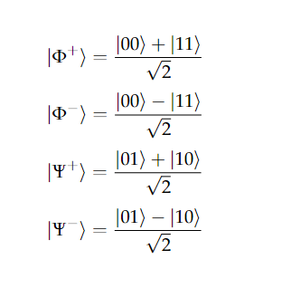
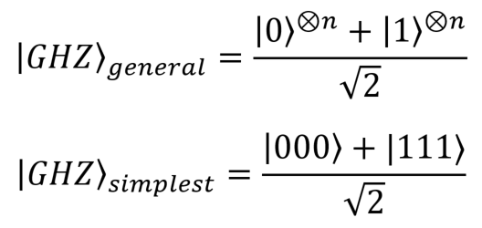

# Setup
We shall be using IBM's Qiskit programming language for the coding part of QC. You can set it up using either pip or conda using the instructions in their [official guide](https://qiskit.org/textbook/ch-prerequisites/setting-the-environment.html). The guide can also act as a resource for exploring various algorithms. We encourage you to code these algorithms on your own before looking at the implementation in the guide. It will also serve as your tutorial for the Qiskit syntax. 

# Algorithms
We expect you to code the following algorithms and push the codes to the Week 2 folder in your github repositories. 
## Preparation of States
Prepare the following states using only basic 2 qubit gates in Qiskit:
* Bell States : Hint: Think about how you can use trigerred gate

 

* GHZ state : Hint: Can you extend Bell state to this?

These rely on fundamental gates for creation. There are several other techniques for preparing states such as by arbitary rotation or by measurement (repeat until success) that we won't explore here.
## Basic operations
Perform the following operations using basic gates in Qiskit:
* Swapping Qubits: Take two qubits and swap their states. Refer to QCQI for circuit
* Increment: Suppose we have three qubits which together represent a 3-bit number. So the state |011> represents the number 3. Create a quantum circuit to add 1 to this number. So the circuit should leave the qubits in the above example in the state |100>. This is basically incrementation mod 8. Hint: See what adding one does to each bit. How will you accomodate for carry from one bit to the next?

If you are very much into these, try the following optional exercises: 
* Addition mod 8: Add two 3 bit numbers mod 8
* Implement the < operator on two 3 bit numbers. The output should be stored in a seperate qubit

## Phase Kickback based algorithms
Implement atleast one of the following:
* [Deutsch-Jozsa Algorithm](https://qiskit.org/textbook/ch-algorithms/deutsch-jozsa.html) 
* [Bernstein-Vazirani Algorithm](https://qiskit.org/textbook/ch-algorithms/bernstein-vazirani.html)

Read up the section on [phase kickback](https://qiskit.org/textbook/ch-gates/phase-kickback.html). Try to implement these without looking at the solutions :)

## Quantum Data Tranfer algorithms
Implement atleast one of the following:
* [Quantum Teleportation](https://qiskit.org/textbook/ch-algorithms/teleportation.html)
* [Superdense Coding](https://qiskit.org/textbook/ch-algorithms/superdense-coding.html0)

There are also several algorithms for safe transfer of qubits like [Quantum safe exchange](https://qiskit.org/textbook/ch-algorithms/quantum-key-distribution.html) and Quantum Verification (which you can find in chapter 1 of QCQI) which you can implement if interested.
